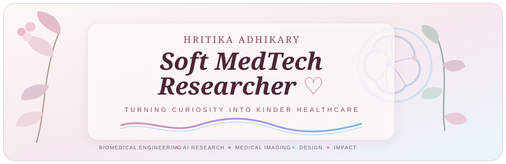
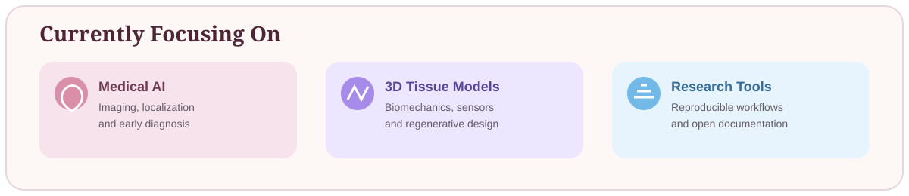
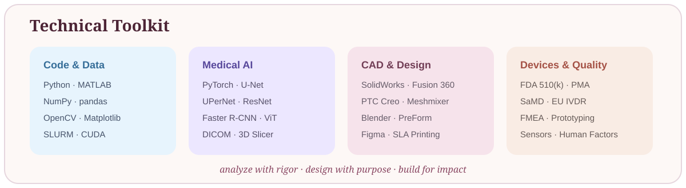

<!-- Soft MedTech Researcher profile theme -->

  

  
  
  

  
  
  
  

## About Me

I am a biomedical engineer building at the intersection of **medical imaging, artificial intelligence, computational modeling, wearable sensing, patient-specific design, and medical-device development**.

My work moves between code and the physical world: from chest X-ray deep learning and physiological signals to finite-element tissue models, DICOM reconstruction, implant design, additive manufacturing, and regulatory strategy. I care about technology that is technically rigorous, clinically meaningful, and kinder to the people who use it.

- 📍 Tempe, Arizona
- 🎓 M.S. Biomedical Engineering, Arizona State University — **GPA 3.65/4.00**
- 🎓 B.Tech. Biomedical Engineering, Adamas University — **CGPA 8.88/10**
- 🔬 Interested in biomedical engineering, medical imaging, research, AI, and medical-device roles

  

## My Work, Organized by Field

### 🧠 AI & Medical Imaging

<table>
<tr>
<td width="50%" valign="top">

#### [Deep Learning for Medical Image Analysis](https://github.com/hrix7/Medical-Imaging-Deep-Learning)

Built chest X-ray pipelines for classification, lung and multi-class segmentation, and lesion localization.

**Results:** 95% classification accuracy · 0.89 lung Dice · UPerNet · Faster R-CNN

<code>Python</code> <code>PyTorch</code> <code>DICOM</code> <code>SLURM</code> <code>A100 GPU</code>

</td>
<td width="50%" valign="top">

#### [AI Agent & Automation Lab](https://github.com/hrix7/AI-Agent-Automation-Lab)

Built research-folder and file-verification tools while studying MCP, Git automation, n8n, coding agents, and human approval.

<code>Python</code> <code>MCP</code> <code>Git</code> <code>n8n</code> <code>AI Agents</code>

</td>
</tr>
</table>

### 💗 Biomechanics & Computational Modeling

<table>
<tr>
<td width="50%" valign="top">

#### [3D Pressure Sore Tissue Model](https://github.com/hrix7/3D-Pressure-Sore-Tissue-Model)

Designed a multilayer tissue phantom with embedded-sensor channels and completed **15 FEA cases** across three geometries and five pressure levels.

<code>SolidWorks</code> <code>FEA</code> <code>Biomechanics</code> <code>Formlabs</code>

</td>
<td width="50%" valign="top">

#### [Ergonomic Risk Assessment](https://github.com/hrix7/Biomedical-Engineering-Portfolio)

Assessed musculoskeletal risk for South Asian tea leaf pickers and proposed practical interventions.

<code>RULA</code> <code>REBA</code> <code>NIOSH</code> <code>Human Factors</code>

</td>
</tr>
</table>

### 〰️ Wearables & Biomedical Signals

<table>
<tr>
<td width="50%" valign="top">

#### [Wearable Gait & Fall-Risk System](https://github.com/hrix7/Wearable-Gait-Fall-Risk-System)

Designed an IMU, FSR, and PPG system for step, stride, sway, symmetry, heart-rate, and fall-risk assessment.

<code>IMU</code> <code>FSR</code> <code>PPG</code> <code>MATLAB</code> <code>Python</code>

</td>
<td width="50%" valign="top">

#### [Biomedical Signal Processing](https://github.com/hrix7/Biomedical-Signal-Processing)

Implemented PPG heart-rate estimation, signal-quality checks, and sleep/social-jet-lag analysis utilities.

<code>SciPy</code> <code>Peak Detection</code> <code>PPG</code> <code>Sleep Analysis</code>

</td>
</tr>
</table>

### 🧬 Patient-Specific Design & 3D Visualization

<table>
<tr>
<td width="50%" valign="top">

#### [Patient-Specific Medical Design](https://github.com/hrix7/Patient-Specific-Medical-Design)

Led **10+ CT/MRI reconstruction cases** and designed CMF and orthopedic implants as an Operations Engineer at **Steroviz Pixels Pvt. Ltd.**

<code>3D Slicer</code> <code>DICOM</code> <code>STL</code> <code>CAD</code> <code>3D Printing</code>

</td>
<td width="50%" valign="top">

#### [Computer Graphics & 3D Visualization](https://github.com/hrix7/Computer-Graphics-and-3D-Visualization)

Completed Stanford's Computer Graphics and Imaging Summer Session and created a final rendered scene.

<code>Blender</code> <code>Rendering</code> <code>Transforms</code> <code>Lighting</code> <code>NumPy</code>

</td>
</tr>
</table>

### ⚕️ Medical Devices, Regulatory & IoT

<table>
<tr>
<td width="50%" valign="top">

#### [Medical Device Regulatory Analysis](https://github.com/hrix7/Medical-Device-Regulatory-Analysis)

Analyzed ESRD and wearable artificial kidney technology, evidence expectations, device risk, and U.S. regulatory pathways.

<code>FDA 510(k)</code> <code>De Novo</code> <code>PMA</code> <code>FMEA</code> <code>SaMD</code>

</td>
<td width="50%" valign="top">

#### [IoT Composter & Hydroponics System](https://github.com/hrix7/IoT-Composter-Hydroponics-System)

Contributed to a 10-member undergraduate project integrating pH, conductivity, temperature, web monitoring, and a 3D-printed structure.

<code>IoT</code> <code>Sensors</code> <code>CAD</code> <code>3D Printing</code> <code>Python</code>

</td>
</tr>
</table>

### 📚 Research & Publications

<table>
<tr>
<td width="50%" valign="top">

#### [Conference Publications](https://github.com/hrix7/Conference-Publications)

Two collaborative biomedical engineering papers accepted for an **October 2026 conference at Carnegie Mellon University**.

<code>Research</code> <code>Scientific Writing</code> <code>Metadata Validation</code>

</td>
<td width="50%" valign="top">

#### [Biomedical Engineering Portfolio](https://github.com/hrix7/Biomedical-Engineering-Portfolio)

The central catalog connecting my technical projects, professional work, research experience, and reproducible tools.

<code>Biomedical Engineering</code> <code>Research</code> <code>Design</code> <code>Documentation</code>

</td>
</tr>
</table>

  

## Professional Experience

| Role | Organization | What I contributed |
|---|---|---|
| **Instructional Aide — Biomaterials** | Arizona State University | Supported graduate instruction, grading, Canvas administration, and student questions. |
| **Biomedical Researcher** | Purcell BioPro | Improved a patient-facing inhaler application workflow in Figma, focusing on guidance and device connectivity. |
| **Operations Engineer** | Steroviz Pixels Pvt. Ltd. | Led CT/MRI reconstructions, designed patient-specific implants, optimized STL files, and collaborated with surgeons. |
| **Biomedical Intern** | Ruby General Hospital | Supported maintenance, troubleshooting, and repair of devices across the OT, ICU, Cath Lab, and Emergency departments. |

  

## GitHub at a Glance

  
  

## Education

- **Arizona State University** — M.S. Biomedical Engineering, GPA 3.65/4.00
- **Stanford University** — Summer Session, Computer Graphics and Imaging
- **Adamas University** — B.Tech. Biomedical Engineering, CGPA 8.88/10

  

