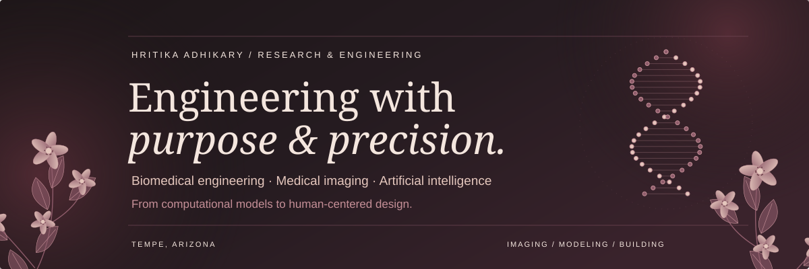
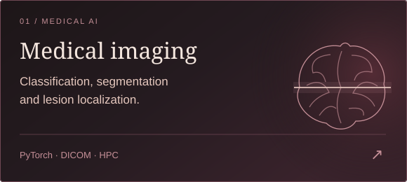
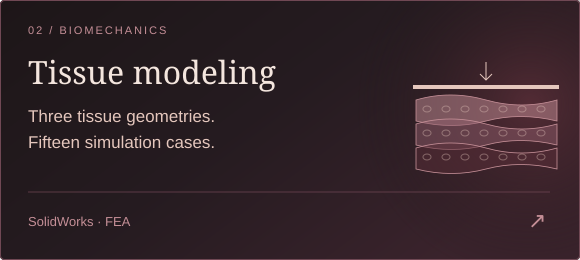
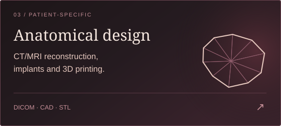
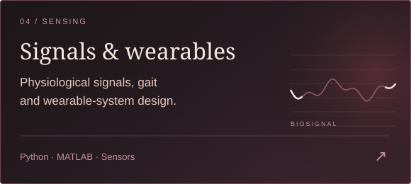
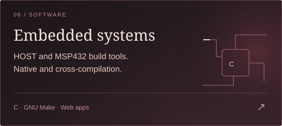

  

  <a href="https://github.com/hrix7/Biomedical-Engineering-Portfolio">PORTFOLIO</a> &nbsp; · &nbsp;
  <a href="https://github.com/hrix7/Conference-Publications">RESEARCH</a> &nbsp; · &nbsp;
  <a href="#project-index">PROJECT INDEX</a> &nbsp; · &nbsp;
  <a href="#experience">EXPERIENCE</a>

### Biomedical engineer. Researcher. Builder.

I’m **Hritika Adhikary**, a biomedical engineer based in Tempe, Arizona. My work connects medical imaging and AI with computational modeling, physiological signals, and patient-specific design. I enjoy moving between code and physical systems—turning research questions into models, tools, and practical engineering decisions.

**M.S. Biomedical Engineering · Arizona State University**  
Interested in biomedical research, medical imaging, AI, and medical-device engineering opportunities.

## Selected work

  
  

  
  

  
  

## Project index

| Field | Projects | Focus |
| :--- | :--- | :--- |
| Medical imaging & AI | [Medical Imaging Deep Learning](https://github.com/hrix7/Medical-Imaging-Deep-Learning) | Chest X-ray classification, segmentation, lesion localization |
| Biomechanics | [3D Pressure Sore Tissue Model](https://github.com/hrix7/3D-Pressure-Sore-Tissue-Model) · [Ergonomic Assessment](https://github.com/hrix7/Biomedical-Engineering-Portfolio) | Multilayer phantom design, 15 FEA cases, ergonomic risk assessment |
| Signals & wearables | [Wearable Gait & Fall Risk](https://github.com/hrix7/Wearable-Gait-Fall-Risk-System) · [Biomedical Signal Processing](https://github.com/hrix7/Biomedical-Signal-Processing) | IMU/FSR/PPG concepts, gait metrics, heart-rate and sleep analysis |
| Design & visualization | [Patient-Specific Medical Design](https://github.com/hrix7/Patient-Specific-Medical-Design) · [Computer Graphics](https://github.com/hrix7/Computer-Graphics-and-3D-Visualization) | Anatomical reconstruction, implant CAD, Blender rendering |
| Devices & translation | [Regulatory Analysis](https://github.com/hrix7/Medical-Device-Regulatory-Analysis) · [IoT Composter & Hydroponics](https://github.com/hrix7/IoT-Composter-Hydroponics-System) | Renal-device analysis, regulatory pathways, sensor integration |
| AI & automation | [AI Job Search Crew](https://github.com/hrix7/Biomedical-Engineering-Portfolio/tree/main/projects/ai-job-search-crew) · [AI Agent Automation Lab](https://github.com/hrix7/AI-Agent-Automation-Lab) | Local tools, evidence-linked drafts, human review, MCP learning |
| Embedded systems & apps | [Embedded C Build System](https://github.com/hrix7/Biomedical-Engineering-Portfolio/tree/main/projects/embedded-c-build-system) · [Application Desk](https://github.com/hrix7/Biomedical-Engineering-Portfolio/tree/main/projects/application-desk) | HOST/MSP432 Makefiles; browser tracker, Part 1 |
| Research | [Conference Publications](https://github.com/hrix7/Conference-Publications) | Collaborative biomedical engineering papers and publication records |

<strong>Current development notes</strong>

- **AI Job Search Crew:** local dashboard and reviewed-draft workflow implemented. Optional local-model testing on my Mac remains pending.
- **Application Desk:** browser tracker, Part 1. Claude Desktop/MCP integration is a later phase; the GitHub entry currently contains an overview and Site link.
- **Embedded C:** completed build files and prior HOST/MSP432 verification. MCU execution on physical hardware is not claimed.
- **Pressure-sore model:** completed design and simulation work. Sensor integration and physical testing remain future work.

## Experience

| Role | Organization | Contribution |
| :--- | :--- | :--- |
| Instructional Aide · Biomaterials | Arizona State University | Instruction support, grading, Canvas administration and student questions |
| Biomedical Researcher | Purcell BioPro | Patient-facing inhaler interface research and Figma workflow design |
| Operations Engineer | Steroviz Pixels Pvt. Ltd. | 10+ CT/MRI reconstruction cases, patient-specific implant design, STL preparation and surgeon collaboration |
| Biomedical Intern | Ruby General Hospital | Device maintenance and troubleshooting across OT, ICU, Cath Lab and Emergency departments |

## Technical practice

**Code & data** — Python, MATLAB, NumPy, pandas, SciPy, OpenCV, Matplotlib, C, GNU Make  
**Imaging & AI** — PyTorch, U-Net, ResNet, UPerNet, Faster R-CNN, DICOM, 3D Slicer, SLURM  
**Design & fabrication** — SolidWorks, Fusion 360, PTC Creo, Meshmixer, Blender, PreForm, SLA printing, Figma  
**Devices & analysis** — FDA pathway analysis, FMEA, physiological signals, human factors, RULA/REBA

## Education

**Arizona State University** — M.S. Biomedical Engineering · GPA 3.65/4.00  
**Stanford University** — Summer Session · Computer Graphics and Imaging  
**Adamas University** — B.Tech. Biomedical Engineering · CGPA 8.88/10

  

